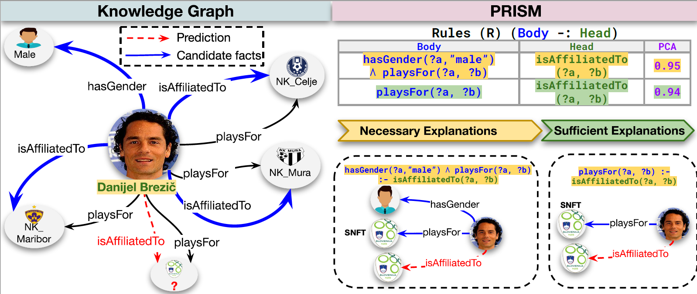

# PRISM: Neuro-Symbolic Explanations for Link Prediction over Knowledge Graphs 🧠🔍

## Overview

**PRISM** is a neuro-symbolic explanation framework for **Link Prediction (LP)** over **Knowledge Graphs (KGs)**. It explains why a Knowledge Graph Completion (KGC) model predicts a missing fact by identifying the facts that are most relevant to the prediction.

PRISM combines **symbolic reasoning** with **Knowledge Graph Embeddings (KGEs)** to generate explanations that are:

- **Faithful** to the behaviour of the underlying LP model.
- **Interpretable** through explicit KG facts and symbolic reasoning patterns.
- **Efficient** by reducing the number of candidate facts that must be explored.

> 🎯 PRISM builds on top of the KELPIE [1] framework and extends it with neuro-symbolic explanation strategies that exploit both explicit semantic knowledge and latent embedding-based representations.

PRISM associates each predicted relationship with two complementary forms of explanation:

- **Necessary explanations** identify facts that are essential for the prediction. Removing these facts should weaken or invalidate the predicted relationship.
- **Sufficient explanations** identify additional facts that support the predicted relationship. Adding or emphasizing these facts should strengthen the prediction.

We empirically evaluate PRISM across **336 testbeds for necessary explanations** and **336 testbeds for sufficient explanations**, assessing explanation quality, faithfulness, interpretability, and computational efficiency.

> **Note:** The complete reproducibility of all testbeds is estimated to require approximately five or six months.

---

## 🔎 Exemplary Subgraph

Below is an example of how PRISM explains a missing link prediction in a KG:



The figure illustrates how PRISM uses symbolic rules, KG structure, and embedding-based relevance signals to generate necessary and sufficient explanations for a predicted missing relationship.

> If the repository still contains the original SPLAIN figure file, rename it from `images/SPLAIN-Example-necessary-sufficient.png` to `images/PRISM-Example-necessary-sufficient.png`, or update the path above accordingly.

---

## 🧾 Repository Structure

| Path                     | Description                                                                                         |
|--------------------------|-----------------------------------------------------------------------------------------------------|
| `data/`                  | All experiment-related artifacts.                                                                  |
| ├── `0_rules/`           | Symbolic rules used during explanation generation.                                                  |
| ├── `1_triple_store/`    | KG triples, including train, validation, and test splits.                                           |
| ├── `2_stored_models/`   | Pre-trained KGE models.                                                                            |
| ├── `3_filtered_ranks/`  | LP model predictions with ranking information.                                                      |
| ├── `4_predictions/`     | Tab-separated triples used as input for explanation generation.                                     |
| ├── `5_explanations/`    | Explanations generated by PRISM and used for verification.                                          |
| ├── `6_statistics/`      | Evaluation metrics from explanation generation and verification.                                    |
| ├── `7_logging/`         | Logs for tracking experimental runs.                                                               |
| ├── `temp/`              | Temporary files generated during rule and triple processing.                                        |
| `scripts/`               | Benchmark-specific folders containing `run.sh` scripts and configuration files.                     |
| `src/`                   | Source code of the project.                                                                         |
| ├── `embeddings/`        | Training, testing, explanation, and verification scripts for KGE models.                            |
| ├── `explanation_builders/` | Logic for constructing necessary and sufficient explanations.                                    |
| ├── `link_prediction/`   | Embedding model implementations and LP utilities.                                                   |
| ├── `model/`             | PRISM and KELPIE architecture logic.                                                               |
| ├── `prefilters/`        | Filtering strategies for selecting semantically relevant candidate facts.                           |
| ├── `relevance_engines/` | Score computation for candidate explanatory triples.                                                |
| ├── `rules/`             | Code and binaries for symbolic rule mining.                                                        |
| `create_environment.sh`  | Shell script to install Python dependencies.                                                       |
| `requirements.txt`       | Python dependency list.                                                                            |
| `config.py`              | Project-wide configuration values.                                                                 |

---

## 🔁 Reproducibility of Experiments

Reproducing the results in our study is straightforward with the provided scripts and input configurations.

### ✅ Steps to Reproduce

1. **Set up the environment**

   ```bash
   bash create_environment.sh
   ```

2. **Prepare symbolic rules**

   Run AMIE [2] with the appropriate training triples:

   ```bash
   java -jar amie -const -minpca 0.7 -dpr -optimai path/to/train.txt > path/to/rules.txt
   ```

3. **Navigate to a benchmark folder**

   ```bash
   cd scripts/FrenchRoyalty  # or DB100K, FB15K-237, YAGO3-10
   ```

4. **Edit the input configuration**

   Update `input.json` or the benchmark-specific configuration file to specify:

   - the explanation mode: `necessary` or `sufficient`,
   - the embedding model: `TransE`, `ComplEx`, or `ConvE`,
   - the explanation builders to be used,
   - the rule files and prediction files.

5. **Run explanation generation**

   ```bash
   bash run.sh
   ```

6. **Analyze the results**

   Explanation and verification metrics are stored in the `data/` folder, especially in:

   - `6_statistics/`
   - `7_logging/`

> 🧪 Our full experimental pipeline was executed using:
>
> - **OS:** Ubuntu 20.04.5
> - **Python:** 3.10
> - **GPU:** NVIDIA A100 with 40 GiB VRAM
> - **CUDA:** 12.2

---

## Running PRISM 🚀

Navigate to a benchmark-specific folder and execute `run.sh` to generate explanations:

```bash
cd scripts/FrenchRoyalty
bash run.sh
```

This executes the explanation extraction script, for example `transe-fr-script.py`, using the configuration specified in `input_transe_fr.json`. The script generates explanations across the selected explanation builders and stores the outputs in the corresponding `data/` subfolders.

---

## Example `input_transe_fr.json`

```json
{
  "dataset": "FR_Reduced_2K",
  "embedding_model": "TransE",
  "predictions": "FR_10.csv",
  "rules_file": "fr_reduced_2k_rules_optimai.csv",
  "editorial_rules": "FR_editorial_rules.csv",
  "dimension": 50,
  "batch_size": 1906,
  "negative_samples_ratio": 5,
  "e_regularizer_weight": 50.0,
  "v_regularizer_weight": 2.0,
  "margin": 2,
  "e_learning_rate": 0.003,
  "v_learning_rate": 0.00003,
  "e_epochs": 100,
  "v_epochs": 10,
  "thr": 0.7,
  "coverage": 3,
  "mode": "sufficient",
  "builders": ["kelpie", "pca", "frequency"]
}
```

---

## Parameter Description

| Parameter              | Description                                                                 |
|------------------------|-----------------------------------------------------------------------------|
| `dataset`              | Name of the dataset, for example `FR_Reduced_2K`.                            |
| `embedding_model`      | KGE model used for LP, such as `TransE`, `ComplEx`, or `ConvE`.              |
| `predictions`          | CSV file containing the predictions to explain.                              |
| `rules_file`           | Symbolic rules generated by AMIE.                                            |
| `editorial_rules`      | Optional user-defined rules.                                                 |
| `dimension`            | Embedding vector dimension.                                                  |
| `batch_size`           | Batch size for model training.                                               |
| `negative_samples_ratio` | Number of negative samples per positive triple.                            |
| `e_regularizer_weight` | Regularization weight for embedding training.                                |
| `v_regularizer_weight` | Regularization weight during verification.                                   |
| `margin`               | Margin used in the loss function.                                            |
| `e_learning_rate`      | Learning rate for embedding training.                                        |
| `v_learning_rate`      | Learning rate for verification.                                              |
| `e_epochs`             | Number of epochs for embedding training.                                     |
| `v_epochs`             | Number of epochs used during verification.                                   |
| `thr`                  | Threshold used for rule or candidate filtering, for example PCA confidence.  |
| `coverage`             | Number of explanations to return per prediction.                             |
| `mode`                 | Explanation type: `necessary` or `sufficient`.                               |
| `builders`             | List of explanation builders to apply.                                       |

---

## ⚙️ Hyperparameters for Training Knowledge Graph Embedding Models

The experimental evaluation encompasses three embedding representation spaces: TransE [6], ConvE [7], and ComplEx [8].

| Model      | Epochs | Batch Size | Learning Rate | Embedding Dim |
|------------|--------|------------|----------------|---------------|
| **TransE** | 100    | 2048       | 0.001          | 200           |
| **ConvE**  | 500    | 128        | 0.003          | 200           |
| **ComplEx**| 50     | 128        | 0.1            | 100           |

> 💡 These hyperparameters were tuned for fair comparison and consistent results across benchmarks.

---

## 📚 Benchmark Knowledge Graphs

### 📈 Statistics

| Benchmark        | Entities | Relations | Triples   |
|------------------|----------|-----------|-----------|
| French Royalty   | 2,601    | 12        | 10,526    |
| YAGO3-10         | 123,086  | 37        | 1,080,264 |
| FB15K-237        | 40,943   | 18        | 151,442   |
| DB100K           | 99,604   | 470       | 695,572   |

### 📄 Benchmark Descriptions

- **French Royalty** 👑 [3]  
  A curated KG derived from DBpedia about historical French royals, including facts such as gender, spouse, successor, and related relations.  
  Entities: 2,601 | Triples: 10,526 | Relations: 12

- **YAGO3-10** 🌍 [9]  
  A dense subset of the multilingual YAGO3 KG with rich information about persons, cities, sports, and organizations.  
  Entities: 123,086 | Triples: 1,080,264 | Relations: 37

- **FB15K-237** 🎬 [10]  
  A subset of Freebase with inverse relations removed to avoid data leakage, covering domains such as music, sports, film, and people.  
  Entities: 40,943 | Triples: 151,442 | Relations: 18

- **DB100K** 📘 [11]  
  A DBpedia-derived KG focused on hierarchical and structured relations. Only entities with rich neighborhoods are retained.  
  Entities: 99,604 | Triples: 695,572 | Relations: 470

---

## License 📄

This project is licensed under the MIT License.

---

## References 📚

1. Andrea Rossi et al. (2022). *Explaining Link Prediction Systems*. SIGMOD.  
2. J. Lajus et al. (2020). *Fast and Exact Rule Mining with AMIE 3*. ESWC.  
3. Halliwell et al. (2021). *User Scored Evaluation of Non-Unique Explanations*. K-CAP.  
4. Kristina Toutanova and Danqi Chen (2015). *Observed versus Latent Features for Knowledge Base and Text Inference*. ACL Workshop.  
5. Jingxiong Wang et al. (2023). *Attention-Based High-Low Level Features Interaction for Knowledge Graph Embedding*. IPM.  
6. Bordes et al. (2013). *Translating Embeddings for Modeling Multi-Relational Data*. NeurIPS.  
7. Dettmers et al. (2018). *Convolutional 2D Knowledge Graph Embeddings*. AAAI.  
8. Trouillon et al. (2016). *Complex Embeddings for Simple Link Prediction*. ICML.  
9. Mahdisoltani et al. (2015). *YAGO3: A Knowledge Base from Multilingual Wikipedias*. CIDR.  
10. Toutanova et al. (2015). *Observed versus Latent Features for Knowledge Base and Text Inference*. ACL.  
11. Wang et al. (2023). *Knowledge Graph Embedding Model with Attention-Based High-Low Level Features Interaction Convolutional Network*. IPM.
